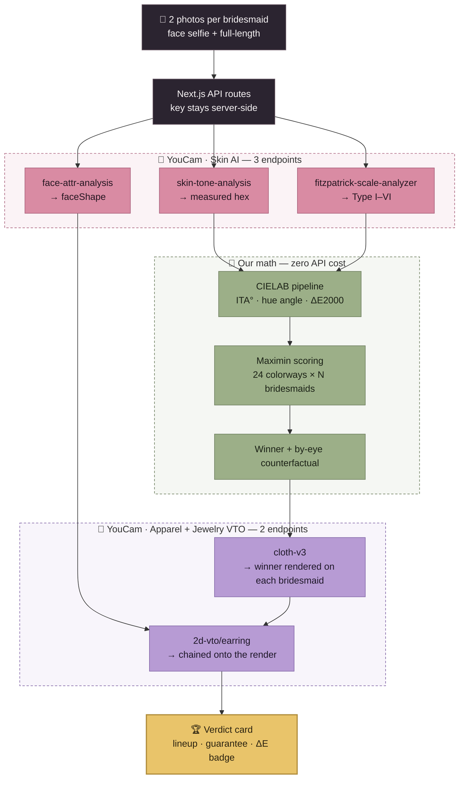

<div align="center">
  
  <h1>OneDress 💍</h1>
  <p><em>Six bridesmaids, six skin tones, one dress color — provably no one's worst option.</em></p>
  

  <br/><br/>

  [](https://onedress.edycu.dev/party)
  [](https://youtu.be/8iKm7LpjUEA)
  [](https://onedress.edycu.dev/pitch)
  [](https://devpost.com/software/onedress)

  <sub>Submitted to the <a href="https://youcam-api.devpost.com/">YouCam API Hackathon</a> — Topic C, Skin AI + Apparel VTO.</sub>

  <br/>

  
  
  
  
  
  
  
  [](https://github.com/edycutjong/onedress/actions/workflows/ci.yml)
  [](https://github.com/edycutjong/onedress/releases)
  
  
  

</div>

---

## 💡 The Problem & Solution

Bridesmaid dresses are one color for the whole party — usually final-sale — and the
color that flatters the bride can drain every other complexion in the photos. The
color is chosen today by eyeballing one retailer model who matches nobody in the party.

**OneDress** measures each bridesmaid's **real skin hex** and **Fitzpatrick depth**, then
solves a constrained group-optimization problem: find the single dress color where the
**least-flattered person is lifted the most** (max-of-minimum fairness), and render it
photorealistically on every bridesmaid at once.

It's the inverse of a personal-color quiz: not "what's *my* season?" but **"given one
garment all N people must wear, which single color harms the group least?"** — a question
single-user analysis can't answer, because the group's answer is never any individual's
top pick.

## 🔬 Verified live against the YouCam API (Perfect Corp)

The sponsor SDK is the **engine**, not decoration. All five load-bearing endpoints are
proven end-to-end by a live spike (`scripts/spike.ts`, `npm run spike`):

| # | Endpoint | Role | Verified result |
|---|---|---|---|
| 1 | `skin-tone-analysis` | measured skin hex — the scoring input | e.g. `#bb9982` → ITA° 43, hue° 61 |
| 2 | `fitzpatrick-scale-analyzer` | Type I–VI depth cross-check | e.g. `Type II` |
| 3 | `face-attr-analysis` | `faceShape` → earring silhouette | e.g. `Heart` |
| 4 | `cloth-v3` | render the winning color on each bridesmaid | render-fidelity **ΔE00 median 7.8** (5.5–11.2) |
| 5 | `2d-vto/earring` | chained onto the render (undertone → metal) | gold hoop landed on the render |

**Measured cost:** a full one-person run is **43 units** (skin-tone 20 + fitzpatrick 10 +
face-attr 10 + cloth-v3 2 + earring 1) — independently confirmed by the credit-balance
delta in `npm run bench`. Analysis is the cost center, so each bridesmaid is measured
**once per run** and every re-score after that is free (ranking all 24 colorways is pure
local math, zero API cost).

## 🎨 The scoring engine (published, not a black box)

For each `(bridesmaid p, colorway c)`:

```
flatter(p, c) = 0.50·U + 0.30·C + 0.20·S
  U  undertone harmony   — dress warmth vs skin warmth (from CIELAB hue angle)
  C  value contrast      — |ΔL*| in a flattering band (triangular, not "max distance")
  S  saturation harmony  — enough chroma separation to read as its own color
```

The group objective is **Rawlsian max-of-minimum** — optimize the *worst* individual, not
the average:

```
groupScore(c) = min over bridesmaids p of flatter(p, c)
winner        = argmax over colorways c of groupScore(c)     ← nobody is anyone's worst
by-eye pick   = argmax over colorways c of mean_p flatter    ← how it's chosen today
```

The **by-eye** (mean-maximizing) pick is the counterfactual, and the gap between the two
objectives is the whole product. Run on synthetic Fitzpatrick I–VI profiles, they choose
**different colorways**: maximizing the average picks `rust`, which is excellent for four
of six and drops the deepest-skin bridesmaid to **38.8/100**. The maximin winner,
`marigold`, lifts her to **65.3** — a **26.5-point swing on one person** — with nobody in
the party below **57.8**.

Who the objective protects is **party-dependent, not structural**: it defends whoever the
available palette serves worst, which on some parties is a mid-tone member nobody thinks to
check. We report who it actually turned out to be on each run rather than assuming. The color
math (sRGB → CIELAB D65, ITA°, hue angle, ΔE2000) is fixed physics; the three weights and
transfer-function constants are disclosed, calibratable parameters. Full derivation:
`lib/colorway/engine.ts`.

## 🏗️ Architecture & Tech Stack



**Rose is the sponsor's Skin AI, violet is its VTO, sage is our own math.** The colour split
is the Topic C argument in one glance: five YouCam endpoints doing the measuring and the
rendering, with a deterministic engine in between that turns measurements into a decision.

Each bridesmaid is measured **once per run**; every re-score after that is pure local
maths, so ranking all 24 colorways again costs zero API units. Only a re-render calls out.

| Layer | Technology |
|---|---|
| **Frontend** | Next.js 15 (App Router), React 19, Tailwind CSS |
| **Language** | TypeScript (strict) |
| **API client** | Typed, Zod-validated wrapper (`lib/youcam/`) — token-bucket rate limit, retry/backoff, bounded polling. The API key stays server-side. |
| **Scoring** | Pure, deterministic engine (`lib/colorway/`, `lib/color/`) — zero network, unit-tested |
| **Sponsor API** | YouCam API (Perfect Corp) — 5 endpoints across Skin AI + Apparel VTO |
| **Testing** | Vitest (unit) + Playwright (E2E) + Lighthouse CI |

## 📊 Engineering rigor

Every number below is printed by a command in this repo — none are estimates. Where a
number isn't measured yet, it says so instead of guessing. The live-API rows need a key;
tests and coverage run with no key and no network.

| Metric | Value | Where it comes from |
|---|---|---|
| Unit tests | **77 passing** | `npm run test` |
| Coverage | **100%** — statements, branches, functions, lines | `npm run test:coverage` |
| E2E tests | **16 passing** (desktop + mobile) | `npm run e2e` |
| CI pipeline | **6 stages**, parallel, concurrency-guarded | `.github/workflows/ci.yml` |
| Render fidelity | **ΔE00 median 7.8**, range **5.5–11.2** (n=1 subject, 9 patches) | `npm run bench --yes` |
| API cost | **43 units** per bridesmaid, measured | `npm run spike` |
| Live endpoints proven | **5 / 5 green** | `npm run spike` |
| End-to-end latency | **33.4s** for one subject; per-stage medians in [DEMO.md](DEMO.md) | `npm run bench --yes` |
| HTTP requests | **47** for one subject (5 uploads · 5 PUTs · 5 creates · 26 polls · 4 credit · 2 downloads) | `npm run bench --yes` |
| True p50 / p95 | *not measured* — needs ~20 runs (≈860 units, more than the grant) | stated, not guessed |

## 🏆 Sponsor Track

**Topic C — Skin AI + Apparel VTO combined.** OneDress fuses **three Skin AI** endpoints
(`skin-tone-analysis`, `fitzpatrick-scale-analyzer`, `face-attr-analysis`) with **two
Apparel/Jewelry VTO** endpoints (`cloth-v3`, `2d-vto/earring`) into a single decision — the
measured skin values *drive* the render, they aren't shown side by side. Remove any one and
the flow visibly breaks.

**Why it could only be built on YouCam.** The whole thesis needs a *measured* skin value,
not a self-reported season or a swatch a user taps: `skin-tone-analysis` returns an actual
hex we can push through CIELAB, and `fitzpatrick-scale-analyzer` gives an independent depth
reading to cross-check it. That is the input the optimizer needs and the reason the output
is defensible. Then the same vendor renders the result on the real person — so the color we
solved for and the color you see on her are the same pipeline, and we can measure the drift
(ΔE) between them.

**Honest limitations.** Three, stated here rather than left to be discovered:

**1. The render drifts from the intended hex.** `cloth-v3` is a generative try-on, so the
rendered fabric does not land exactly on the target. Measured across 9 patches of one
render: **median ΔE00 7.8, ranging 5.5 to 11.2**. The median is a modest shift; the top of
that range is not — at ΔE00 11 the fabric reads as a neighbouring colour. We publish the
range rather than the flattering point estimate, and put the reference swatch beside every
render. The *decision* is made on measured skin values and fixed colour math, not on the
render; the render is how you check the decision.

**2. The 24 colorway references are recoloured derivatives of one garment.** Openly-licensed
stock has almost no plain single-garment product shots outside a handful of common colours,
so all 24 references in `public/refs/colorways/` are one CC-licensed hanging dress remapped
in Lab space to each target hex (full provenance in [`docs/asset-licences.md`](docs/asset-licences.md)).
Holding the garment constant is arguably the right control for a colour reference set — only
the colour varies — but it does mean the **ΔE00 of 0.51 between target and reference is
calibration, not luck.** It proves the swatches aren't mislabelled and that the Lab→sRGB→JPEG
round trip didn't drift them. It is *not* evidence that a photograph happened to match.

**3. The fairness objective only bites when a party spans widely.** On a party reaching
Fitzpatrick VI, maximin and mean choose different colorways and the gap is 26.5 points. On a
narrower real party we measured (ITA 46.6 → −13.3), **both objectives chose the same colour**
and the counterfactual lift was zero. That is the honest behaviour: when no colorway
disadvantages anyone, OneDress says so instead of manufacturing a difference.

## 🛍️ Why a retailer wants this

The group is the unit of purchase. A bridal party is roughly **six dresses at ~$150 — a
~$900 basket that closes or collapses on a single decision.** It's a final-sale category,
so returns aren't the retailer's lever; the losses are **abandoned carts and stalled group
chats**, which is exactly what an unresolvable colour argument produces.

Perfect Corp already sells try-on widgets onto this precise product page for 800+ brand
partners — and every one of them answers *"how does this look on me?"*. **There is no group
primitive in the category.** OneDress is a net-new SKU for that shelf rather than a
competitor to anything the sponsor ships: one embed that turns six undecided shoppers into
one locked order, and differentiates the retailer on inclusivity in a category where
getting skin tone wrong is permanently photographed.

One honest boundary: the widely-cited ~24–30% apparel return-rate lever does **not** apply
here, because bridalwear is final-sale. That lever belongs to the returnable-apparel
extension, not to the flow we built.

## 🚀 Getting Started

### Prerequisites
- Node.js ≥ 20
- A YouCam API key (see `.env.example`)

### Installation
```bash
git clone https://github.com/edycutjong/onedress.git
cd onedress
npm install
cp .env.example .env.local   # add your YOUCAM_API_KEY
npm run dev                  # http://localhost:3000
```

**Routes — one deploy, three surfaces:**

| Route | What it is | Where it lives |
|---|---|---|
| `/` | Landing page | `public/landing.html` (static, rewritten from `/`) |
| `/pitch` | 10-slide pitch deck | `public/pitch.html` (static, rewritten from `/pitch`) |
| `/party` | **The product** — the 7-step flow | `app/party/page.tsx` |
| `/api/*` | Party orchestration, scoring, upload, credit | `app/api/**` |

### Prove the SDK integration yourself
```bash
npm run spike     # runs all 5 endpoints live and prints a green summary + unit cost
```
> The spike uses local throwaway fixtures (gitignored). No login, no accounts — the app
> is zero-config by design.

## 🧪 Testing & CI

**6-stage pipeline:** Quality → Security → Build → E2E → Performance → Deploy

```bash
npm run ci            # format:check + lint + typecheck + tests w/ coverage
npm run test          # Vitest unit tests
npm run e2e           # Playwright (mobile + desktop, zero-config)
npm run lighthouse    # Lighthouse CI (a11y is a hard gate)
make security-scan    # npm audit + license check
```

| Layer | Tool | Status |
|---|---|---|
| Code Quality | ESLint + Prettier + TypeScript strict | ✅ |
| Unit Testing | Vitest (77 tests, 100% coverage on all four metrics) | ✅ |
| E2E Testing | Playwright (54 specs: app, marketing routes, demo-mode, responsive) | ✅ |
| Security (SAST) | CodeQL | ✅ |
| Security (SCA) | Dependabot + npm audit | ✅ |
| Secret Scanning | TruffleHog | ✅ |
| Performance | Lighthouse CI | ✅ |

## 📁 Project Structure
```
onedress/
├── app/party/         # Next.js App Router — the product, the 7-step flow
├── app/api/           # route handlers (party, score, upload, credit)
├── public/            # landing.html + pitch.html (served at / and /pitch) + assets
├── lib/
│   ├── youcam/        # typed API client (the only place calls are made)
│   ├── color/         # CIELAB pipeline: ITA°, hue angle, ΔE2000
│   ├── colorway/      # 24 swatches + the maximin scoring engine
│   └── earring/       # faceShape + undertone → silhouette + metal
├── __tests__/         # 77 unit tests, 100% coverage
├── e2e/               # Playwright specs
├── bench/             # reproducible benchmark (dry run by default, zero cost)
├── scripts/spike.ts   # live 5-endpoint proof
├── docs/              # README assets
└── .github/           # CI/CD, CodeQL, Dependabot, community health
```

## 📽️ Demo

**Live:** [onedress.edycu.dev](https://onedress.edycu.dev) — landing · [`/party`](https://onedress.edycu.dev/party) the app · [`/pitch`](https://onedress.edycu.dev/pitch) the deck
**Video:** posted at submission

Deployment is automated — see [`docs/deploy.md`](docs/deploy.md).

## 🗺️ Roadmap

Pre-submission (deadline 2026-08-17).

- [x] Typed YouCam client — file → task → poll, rate limit, retry/backoff
- [x] Live 5-endpoint proof (`npm run spike`) — all green, cost measured
- [x] CIELAB pipeline + published maximin scoring engine, 77 unit tests at 100% coverage
- [x] Full harness: 6-stage CI, CodeQL, Dependabot, Playwright, Lighthouse
- [ ] 7-step interactive UI (Create · Measure · Score · Compare · Render · Finish · Verdict)
- [ ] Cached zero-unit demo party — the live URL's default, no key required
- [x] `npm run bench` — call counts, per-stage latency and ΔE distribution, published in DEMO.md
- [ ] Post-hackathon: real garment catalogue integration, shareable party links

## 📄 License
[MIT](LICENSE) © 2026 Edy Cu

## 🙏 Acknowledgments
Built for the **YouCam API Skin AI & Apparel VTO Hackathon**. Thank you to Perfect Corp for
the YouCam API.
